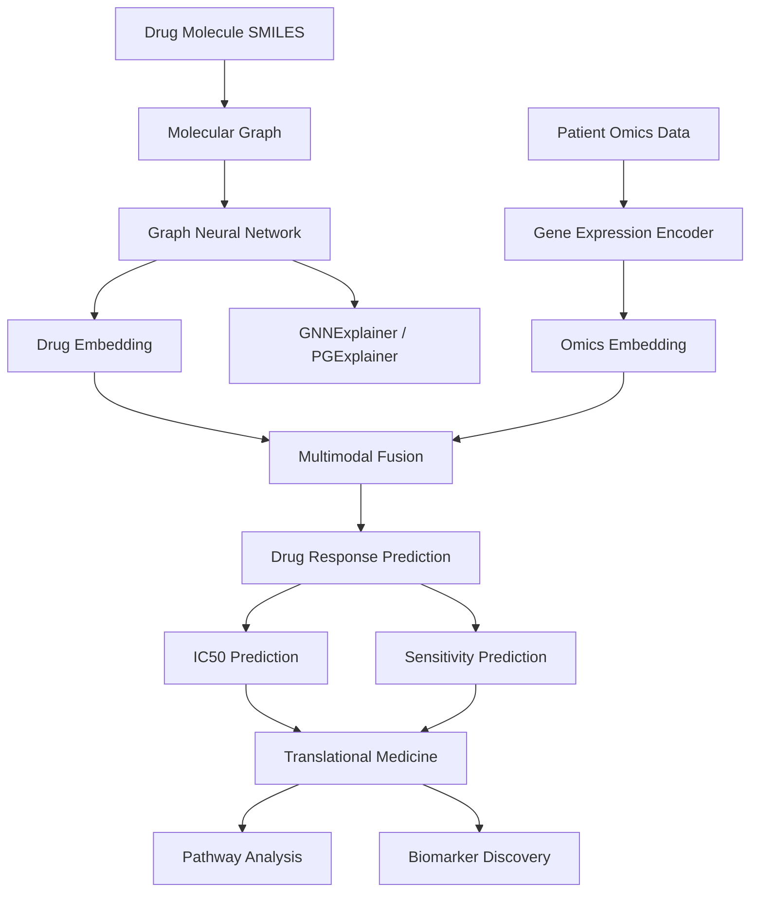

# Explainable-Drug-discovery

## Project Architecture

## Project Structure
ExplainableDrugDiscovery/

│
├── data/
│   ├── drugs.csv
│   ├── gene_expression.csv
│   └── response.csv
│
├── models/
│   ├── gnn.py
│   ├── fusion.py
│   └── predictor.py
│
├── explainability/
│   ├── gnn_explainer.py
│   └── shap_analysis.py
│
├── training/
│   └── train.py
│
├── utils/
│   └── data_loader.py
│
└── requirements.txt
